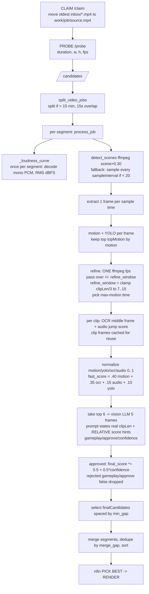

# Pipeline: Current Flow & Improvement Status

This document explains how the highlight-detection pipeline runs **today** (from
a video drop to clip selection) and tracks which improvements are done vs still
pending. It reflects the helper API in `helper/app.py`.

---

## How the flow runs when a video is dropped in `inbox/`



In words: claim -> probe -> build an audio loudness curve + scene-detect to get
candidate timestamps -> score each by motion+YOLO -> keep the most "active" ones
-> nudge each timestamp to a local motion peak (single ffmpeg pass) -> add OCR +
smart-loudness (audio jump) -> blend into a weighted fast score -> send the best 6
to the vision model (clip frames are cached, scores are labelled as relative
ranking hints) -> keep the approved, well-spaced top clips.

### The four scoring signals

| Signal | What it measures | Weight |
|--------|------------------|--------|
| motion | frame-to-frame visual change | 0.40 |
| ocr    | reward text (HEADSHOT, KILL, VICTORY, ...) | 0.35 |
| audio  | smart loudness = biggest short-term loudness *jump* (impact sounds, not loud talking) | 0.15 |
| yolo   | generic COCO object count (weak for games) | 0.10 |

After the fast score ranks the top 6, the vision model decides
`gameplay`/`approve`/`confidence`. Clips the model rejects (`gameplay` or
`approve` false) are dropped; approved clips keep their CV score scaled by
`0.5 + 0.5 * confidence`. The multiplier is deliberately soft because llava is
unreliable at the confidence *number* (it often returns `0.00` for clips it
simultaneously approves), so a raw multiply would wrongly zero good clips.

### Everything scales with `clipLen`

`clipLen` (default 15 s, settable from the n8n body) drives the whole pipeline,
so changing it adapts every stage automatically:

| Derived from clipLen | Rule |
|----------------------|------|
| clip window | `start = t - clipLen/2`, `end = start + clipLen` |
| candidate count cap | `int(dur / clipLen)` |
| refine window (each side) | `clamp(clipLen/3, 7, 15)` -> 10s->7, 15s->7, 30s->10, 45s+->15 |
| vision prompt | tells the model the real "{clipLen}-second clip" |
| spacing / overlap | `min_gap = max(minGap or clipLen, clipLen)` so kept clips never overlap |

---

## What's inside `work/<jobId>/` (the folders explained simply)

Every run builds a working folder per video. Think of it like an assembly line:
each stage drops its files in its own folder, and each stage only looks at a
**smaller, better** set than the one before it.

```
media/
  inbox/                     <- you drop the raw video here
  work/<jobId>/
    source.mp4               <- the claimed video (moved out of inbox)
    frames/                  <- STAGE 1: cheap wide scan (lots of stills)
      cand_0.jpg ...
    refine/                  <- STAGE 2: zoom in on the best moments
      candidate_134/ f_0001.jpg ...
      candidate_512/ ...
    clips/                   <- STAGE 3: 5 stills per surviving clip (OCR+vision)
      clip_0/ frame_0.jpg ... frame_4.jpg
      clip_3/ ...
    renders/                 <- STAGE 4: the finished MP4 clips
      clip_1.mp4 (best) ...
  output/                    <- final posted/archived clips
```

> Long videos (> 15 min) are split first, so you'll instead see
> `work/<jobId>/segment_1/`, `segment_2/`, ... each with its **own** `frames/`,
> `refine/`, `clips/` inside. The renders are merged back at the end.

### What each folder is for, and how many files it should have

| Folder | What it holds | When it fills | How many (formula) |
|--------|---------------|---------------|--------------------|
| `source.mp4` | the input video | at `/claim` | 1 file |
| `frames/` | one still per *seed timestamp* — a cheap "look here" scan | coarse scan, after seeding | = the **"Sampling N frames"** log line = `min(seeds, 160)`. Seeds = scene cuts + audio peaks (+ grid backstop) |
| `refine/candidate_<sec>/` | a burst of stills **around one promising moment**, used to find the exact motion peak | after the top motion candidates are chosen | folders = `candidate_count = max(2, min(topMotion, floor(dur / clipLen)))`; stills per folder ≈ `4 × refine_window` (fps 2, both sides) where `refine_window = clamp(clipLen/3, 7, 15)` |
| `clips/clip_<idx>/` | exactly **5 evenly-spaced stills** (0%, 25%, 50%, 75%, 95%) of one final-length clip — fed to OCR and the vision model | OCR + audio scoring | folders = `candidate_count`; **always 5 stills** each |
| `renders/` | the finished, cropped, faded MP4s | n8n `/render` | = number of clips n8n sends (top 3 for Shorts, or `finalCandidates`) |

### Max at each phase (and which counts match)

Read this top to bottom — the number can only **stay the same or shrink** as you
go down:

| Phase / folder | Max possible | Set by | Same as the phase above? |
|----------------|--------------|--------|--------------------------|
| `frames/` (coarse scan) | **160** | `MAX_COARSE_FRAMES` (hard cap); otherwise = number of seeds | no — this is the widest stage |
| `refine/` (zoom-in) | **`topMotion`** (default **20**) | `candidate_count = max(2, min(topMotion, floor(dur/clipLen)))` | shrinks from `frames/` — we keep only the top `candidate_count` by motion |
| `clips/` (5 stills each) | **same as `refine/`** = `candidate_count` (≤ 20) | loops the **same** candidate list | **YES — identical count to `refine/`** |
| vision model | **6** | `min(6, candidate_count)` (reuses the `clips/` stills, no new folder) | shrinks — only the top 6 by fast_score are judged |
| returned to n8n | **`finalCandidates`** (default **4**) | approved + well-spaced, then capped | shrinks — rejected/overlapping clips dropped |
| `renders/` | **what n8n sends** (top **3** for Shorts) | n8n picks from the returned list | shrinks — you choose top 3 |

So the key answer: **`clips/` has the same number of folders as `refine/`**
(both equal `candidate_count`, at most `topMotion` = 20 by default). Everything
after that only gets smaller: 20 → judged 6 → returned 4 → rendered 3.

> One nuance: `refine/` folders are named by rounded second
> (`candidate_<int(time)>`), so if two candidates land in the same second they
> share a folder and you may see **slightly fewer** `refine/` folders than
> `clips/` folders. The intended count is the same.

### The narrowing funnel (why each stage is smaller)

```
frames/  (e.g. 97 stills)        -> "where might something be?"  (cheap motion+YOLO)
   |  keep top candidate_count by motion
refine/  (e.g. 20 folders)       -> "what's the EXACT best second here?"
   |  same 20, now precisely centered
clips/   (e.g. 20 folders x5)    -> OCR + audio + the vision model judge each
   |  vision approves/rejects, fast_score ranks
return finalCandidates (e.g. 4)  -> n8n picks top 3
renders/ (3 mp4s)                -> clip_1.mp4 (best) ... clip_3.mp4
```

### Worked example

A **10-minute** video (`dur = 600s`), `clipLen = 20`, `topMotion = 20`,
`finalCandidates = 4`:

- `candidate_count = max(2, min(20, floor(600/20)=30)) = 20`
- `refine_window = clamp(20/3 = 6.7, 7, 15) = 7` (so ~`4 × 7 = 28` stills/folder)

| Folder | Count in this example |
|--------|-----------------------|
| `source.mp4` | 1 |
| `frames/` | ~97 (`cand_0.jpg`..`cand_96.jpg`) — whatever "Sampling N frames" says |
| `refine/` | **20** folders, ~28 stills each (`f_0001.jpg`..`f_0028.jpg`) |
| `clips/` | **20** folders (`clip_0`..`clip_19`), **5** stills each = 100 stills |
| returned to n8n | 4 candidates (sorted best→worst, each with `rank`) |
| `renders/` | **3** (`clip_1.mp4` = best, `clip_2.mp4`, `clip_3.mp4`) |

Quick sanity checks if something looks off:
- `frames/` near **160** files → the scan hit the `MAX_COARSE_FRAMES` cap (a
  long/low-signal segment); normal, just the safety ceiling.
- `refine/` and `clips/` folder counts **don't match** → some candidates were
  refined to (nearly) the same timestamp and merged; expected.
- A `clips/clip_*/` folder with **fewer than 5** stills → the clip ran past the
  end of the video (last clip), so a 95% frame couldn't be extracted.

---

## Improvement status

### Tier 1 - accuracy  (PARTIAL)
- [x] **Smart loudness (audio) signal wired in.** `_loudness_curve` runs once per
      segment, decoding the audio to mono 16 kHz PCM and computing RMS loudness
      (dBFS) per hop. `clip_audio_score` scores each clip by its biggest
      short-term loudness *jump* (impact sounds), normalized and added to the
      fast score at weight 0.15. This replaced the earlier ebur128 stderr
      scraping, which silently parsed zero samples on ffmpeg 7.x. Designed so a
      constantly loud talker does NOT score high.
- [ ] **Fix the motion metric.** Still the mean grayscale diff between two
      *candidate* frames (which can be far apart in time), so scene cuts / pans
      still inflate it. Not yet changed to true intra-clip motion.
- [ ] **OCR all 5 frames, take max.** Still reads only the middle (50%) frame, so
      briefly-flashed reward text can be missed.

### Tier 2 - speed  (DONE, except as noted)
- [x] **Cache clip frames.** `load_clip_frames` extracts the 5 clip frames once
      and reuses them for both OCR and vision (was extracting twice).
- [x] **Single-pass refinement.** `refine_candidate` now dumps the whole
      +/- refine_window (clamped clipLen/3, 7..15 s) in ONE `ffmpeg -vf fps=2`
      pass instead of ~28 separate spawns.
- [ ] **Batch the candidate-stage extraction.** Still one ffmpeg per scene-time
      frame (left as-is: aligning a single select-by-timestamp pass to exact
      scene times is error-prone and could corrupt motion pairing).
- [ ] **Parallelize YOLO/OCR/vision.** Deferred on purpose: YOLO/EasyOCR are not
      safe for concurrent inference on a shared model, and the vision step hits a
      single local Ollama/LM Studio server that serves one request at a time, so
      threading risks instability without real speedup.

### Tier 3 - scoring quality  (DONE)
- [x] **YOLO heavily downweighted** (0.30 -> 0.10); weight moved to motion+ocr.
      YOLO is still computed and shown to the LLM, just contributes little.
- [x] **Relative score framing in the prompt.** The CV scores are min-max
      normalized within each video's candidate set, so the prompt now states they
      are RELATIVE ranking hints (1.00 = strongest among candidates), not
      absolute quality measures.
- [x] **Confidence floor removed, multiplier softened.** No `MIN_CONFIDENCE`
      gate; approval relies on the reliable `gameplay`/`approve` booleans, and
      the score blend is `0.5 + 0.5 * confidence` instead of a raw multiply.
- [x] **Auto / non-overlapping spacing.** `minGap = 0` means "auto" -> one
      `clipLen`; the gap is floored at `clipLen` so two kept clips can sit
      back-to-back but never overlap. Applied in both per-segment selection and
      the multi-segment merge.
- [x] **Fully dynamic clip length.** Prompt text, refine window, clip windows,
      candidate count and spacing all derive from `clipLen` (see table above).

---

## Suggested next move
The remaining high-value accuracy items are the two unfinished Tier 1 pieces:
**fix the motion metric** (measure real in-clip motion instead of
candidate-to-candidate diffs) and **OCR all 5 frames and take the max**. Both are
modest changes and would directly improve clip selection accuracy.
